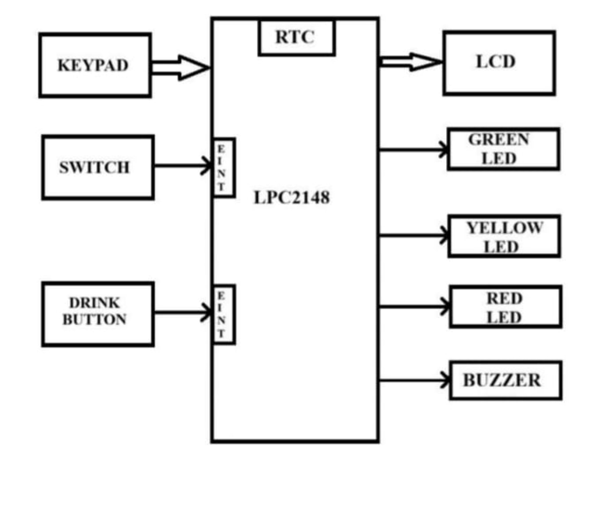

# AquaGuardian: Smart Water Drinking Reminder System

AquaGuardian is an embedded-based **Smart Water Drinking Reminder System** designed to remind users to drink water at regular intervals. The system uses an **ARM7 LPC2148 microcontroller**, **RTC**, **16×2 LCD**, **4×4 keypad**, **switch**, **drink button**, **LED indicators**, **buzzer**, and **interrupts** to provide scheduled hydration reminders and track daily water intake.

## 🎯 Objectives

- Display the current date and time obtained from the RTC on the LCD.
- Generate automatic reminders for drinking water at scheduled intervals.
- Allow the user to record each glass of water consumed using the drink button.
- Maintain a configurable daily water-intake goal.
- Continuously compare the RTC time with the configured reminder interval.
- Display the number of glasses consumed and the remaining daily target on the LCD.
- Provide LED indications for hydration status.
- Generate a buzzer alert when it is time to drink water.
- Reset the daily water-intake record at midnight using the RTC.

## ✨ Features

- RTC-based real-time monitoring
- Automatic drinking reminders
- 16×2 LCD display
- 4×4 matrix keypad for user input
- Drink-button based intake recording
- Green, yellow, and red LED status indication
- Buzzer alert
- Interrupt-based input handling
- Daily hydration target tracking
- Automatic midnight reset

## 🧱 Block Diagram



### Block Diagram Description

The **LPC2148 ARM7 microcontroller** is the central controller of the system.

**Inputs:**
- **Keypad** – used for user input/configuration.
- **Switch** – connected through an external interrupt for user control.
- **Drink Button** – records water consumption through an interrupt.
- **RTC** – provides the current date and time.

**Outputs:**
- **LCD** – displays time, reminder information, glasses consumed, and remaining target.
- **Green LED** – indicates a healthy/achieved hydration status.
- **Yellow LED** – indicates an intermediate/reminder status.
- **Red LED** – indicates a low/attention status.
- **Buzzer** – provides an audible drinking reminder.

## ⚙️ Working Principle

1. On power-up, the LPC2148 initializes the RTC, LCD, keypad, GPIO, buzzer, LEDs, and interrupt configuration.
2. The RTC continuously maintains the current date and time.
3. The microcontroller reads the RTC and compares the current time with the configured drinking-reminder interval.
4. When the reminder time is reached, the buzzer is activated and the LCD displays the reminder.
5. The user presses the **Drink Button** after drinking water.
6. The microcontroller increments the consumed-glass count and updates the remaining daily target.
7. LEDs indicate the current hydration status.
8. At midnight, the daily water-intake count is automatically reset.
9. The system then continues monitoring the next day's hydration schedule.

## 🔩 Hardware Requirements

| Component | Purpose |
|---|---|
| LPC2148 ARM7 Microcontroller | Main controller |
| RTC | Maintains date and time |
| 16×2 LCD | Displays system information |
| 4×4 Matrix Keypad | User input/configuration |
| Switch | User control / interrupt input |
| Drink Button | Records water consumption |
| Green LED | Hydration status indication |
| Yellow LED | Hydration/reminder indication |
| Red LED | Low/attention indication |
| Buzzer | Audible reminder |
| Power Supply | Powers the system |

## 💻 Software Requirements

- Embedded C
- Keil µVision
- ARM7/LPC21xx development environment
- ARM7 compiler
- Flash/programming utility

## 🧩 Software Modules

| Module | Function |
|---|---|
| `main.c` | Main program and overall system flow |
| `aquaguardian.c` | AquaGuardian application logic |
| `aquaguardian.h` | Application declarations |
| `rtc-1.c` | RTC handling |
| `rtc.h` | RTC definitions |
| `lcd (1).c` | LCD interfacing |
| `lcd.h` | LCD declarations |
| `kpm-1.c` | Keypad interfacing |
| `kpm.h` | Keypad declarations |
| `interrupt-1.c` | Interrupt handling |
| `delay (1).c` | Delay functions |
| `types (1).h` | User-defined data types |

## 🔌 Embedded Concepts Used

- ARM7 LPC2148 microcontroller
- Embedded C
- GPIO programming
- RTC interfacing
- LCD interfacing
- Matrix keypad interfacing
- External interrupts
- LED control
- Buzzer control
- Real-time event monitoring
- Modular programming

## 📊 Hydration Status

The LED indicators can be used to represent different hydration conditions:

| Indicator | Status |
|---|---|
| 🟢 Green LED | Healthy / target achieved |
| 🟡 Yellow LED | Reminder / intermediate status |
| 🔴 Red LED | Low hydration / attention required |

> The exact status conditions depend on the thresholds implemented in the project firmware.

## 🧪 Testing

| Test Case | Expected Result |
|---|---|
| Power ON | Peripherals initialize |
| RTC check | Current date/time is available |
| Keypad input | User input is detected |
| Reminder time reached | Buzzer alert is generated |
| Drink button pressed | Consumed-glass count increases |
| LCD update | Current status and target are displayed |
| LED status update | Appropriate LED is activated |
| Midnight reached | Daily intake count resets |

## 🚀 Setup

1. Clone or download this repository.
2. Open the project in **Keil µVision**.
3. Select the appropriate **LPC2148/ARM7** target.
4. Add all required `.c` and `.h` files to the project.
5. Configure the target and compiler settings according to the development board.
6. Build the project.
7. Program the generated binary/HEX file into the LPC2148 board.
8. Connect the RTC, LCD, keypad, buttons, LEDs, and buzzer according to the hardware design.
9. Power the board and configure the required reminder settings.

## 🔮 Future Enhancements

- Mobile application connectivity
- Bluetooth/Wi-Fi monitoring
- Automatic water-flow or quantity measurement
- Daily and weekly hydration statistics
- Cloud-based data storage
- Custom reminder schedules
- Battery-powered operation
- Personalized hydration targets

## 📚 Learning Outcomes

This project provides practical experience in:

- Embedded C programming
- ARM7/LPC2148 peripheral programming
- RTC and LCD interfacing
- Keypad interfacing
- External interrupt programming
- GPIO control
- Modular embedded software development
- Hardware-software integration
- Real-time system design and debugging

## 📁 Repository Structure

```text
AquaGuardian-Smart-Water-Drinking-Reminder-System/
│
├── README.md
├── block_diagram.jpg
│
├── main.c
├── aquaguardian.c
├── aquaguardian.h
├── rtc-1.c
├── rtc.h
├── lcd (1).c
├── lcd.h
├── kpm-1.c
├── kpm.h
├── interrupt-1.c
├── delay (1).c
└── types (1).h
```

## 👩‍💻 Author

**Your Name**

Embedded Systems | ARM7 | Embedded C

GitHub: `https://github.com/<your-username>`

## 📜 License

This project is intended for educational and learning purposes. You may modify and extend it for academic and personal projects, subject to the repository's applicable license terms.

---

**AquaGuardian — Smart Water Drinking Reminder System | ARM7 Embedded Project**
